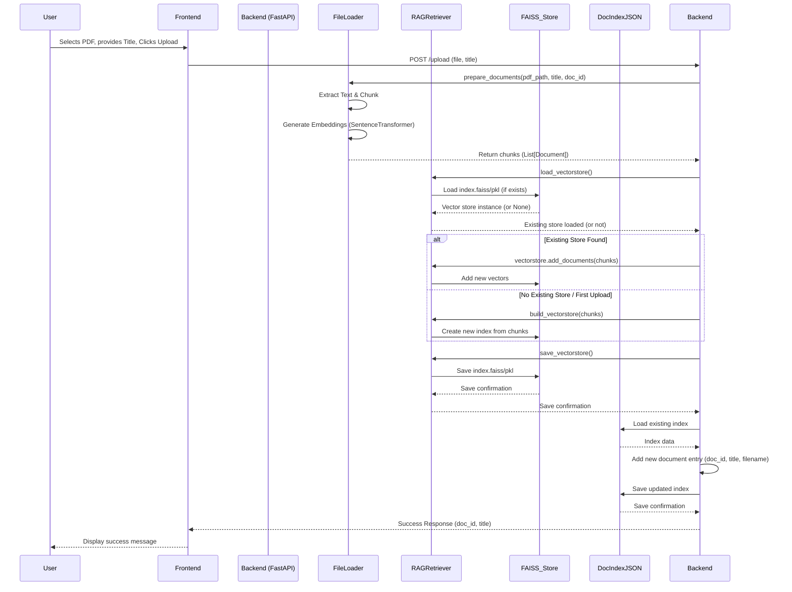
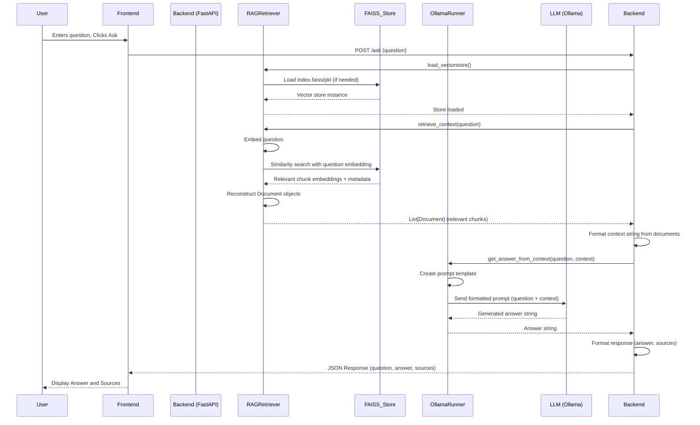
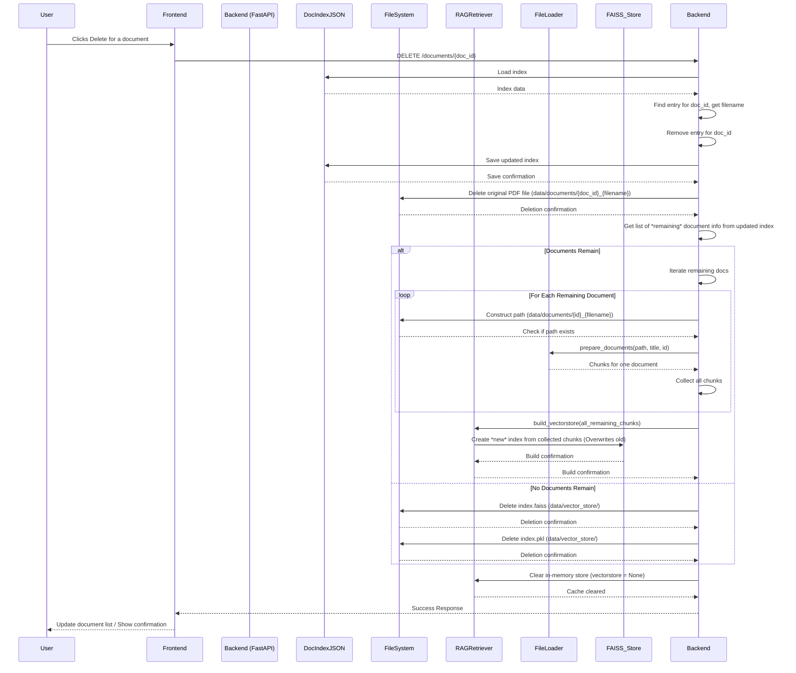

# Chatbot RAG Architecture Diagrams

This document provides diagrams illustrating the key workflows of the Hybrid RAG Chatbot application.

## Document Upload Flow

This diagram shows the sequence of events when a user uploads a PDF document.

## Question Answering Flow

This diagram shows the sequence for answering a user's question.

## Document Deletion Flow

This diagram illustrates the "nuke and rebuild" process when a document is deleted.

