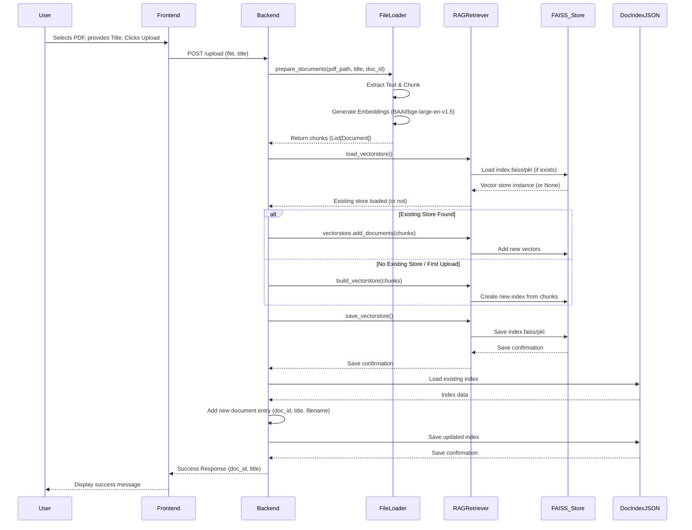
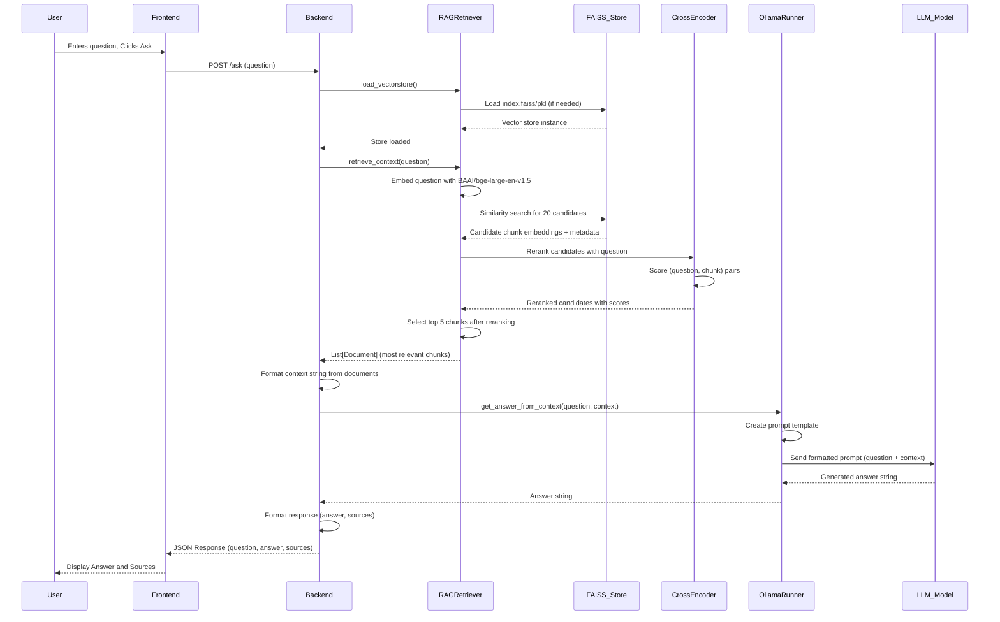
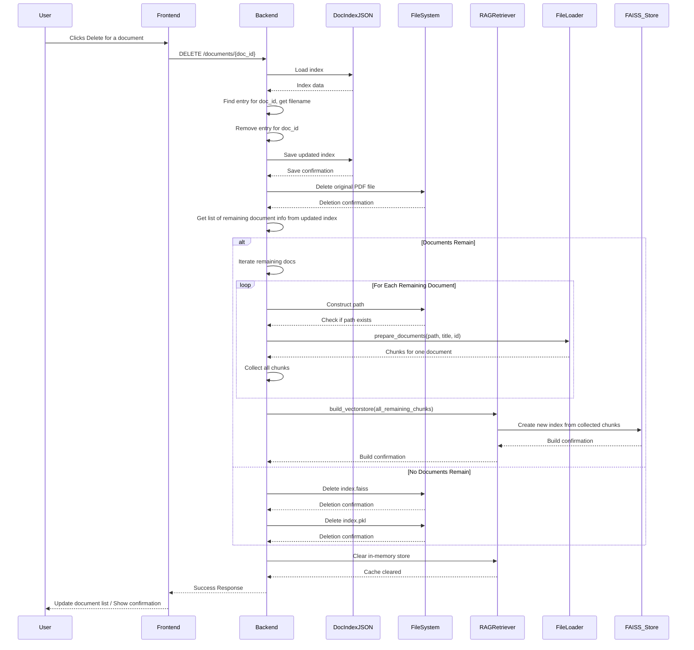

# Architecture Diagrams

This file contains the mermaid diagrams for the Hybrid RAG Chatbot application workflows.

## Document Upload Flow

## Question Answering Flow

## Document Deletion Flow

